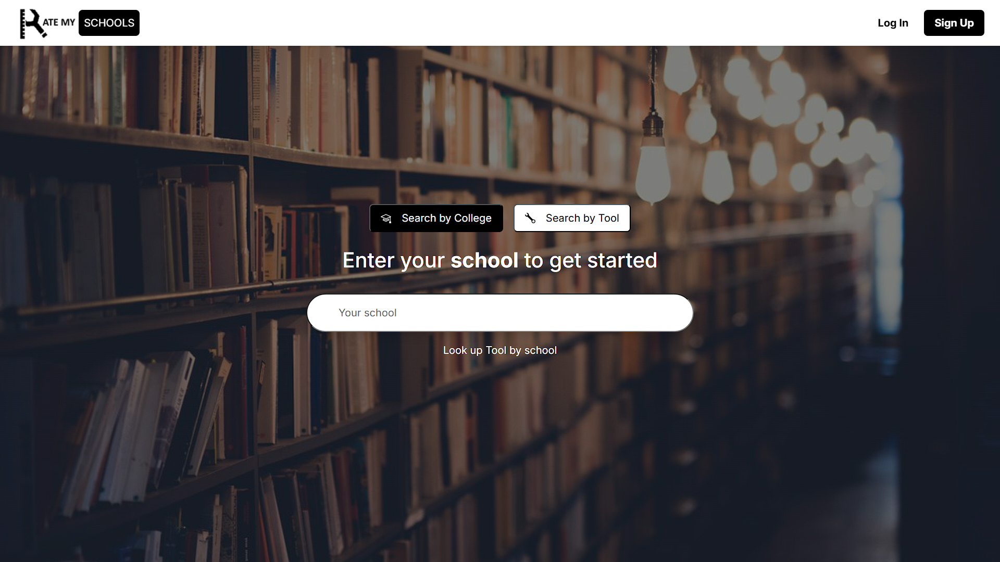
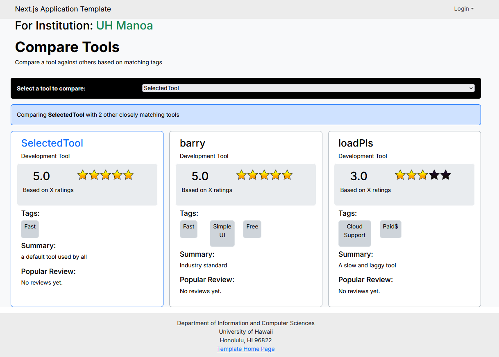
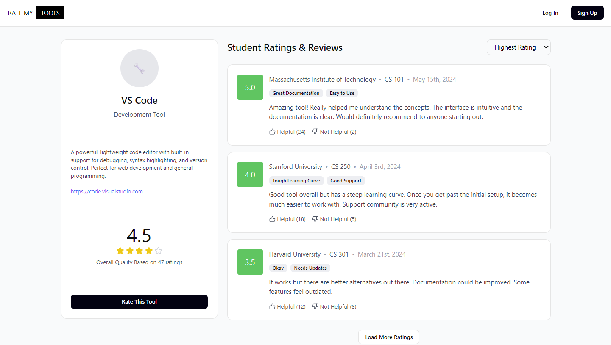
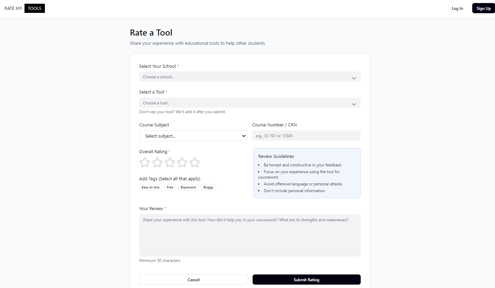
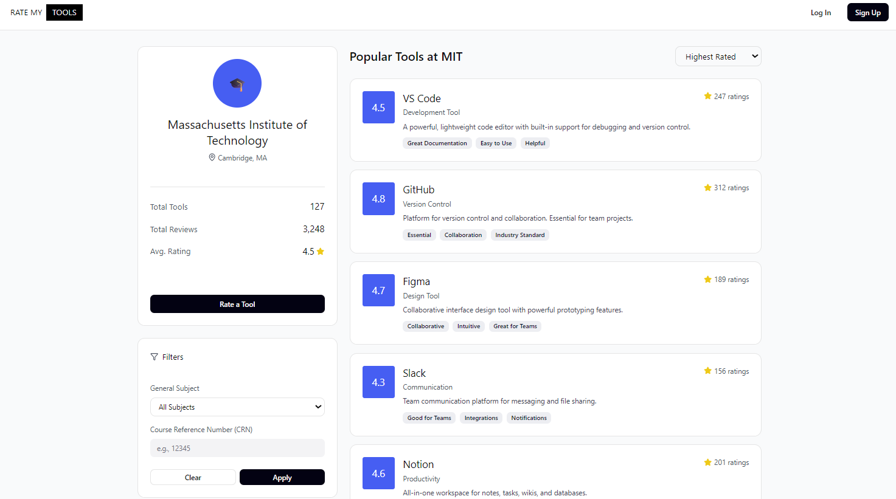
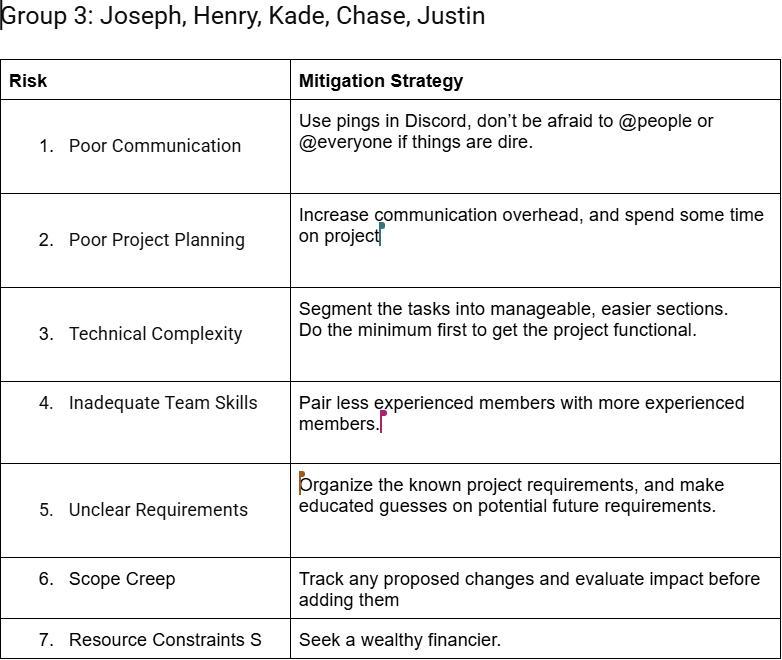
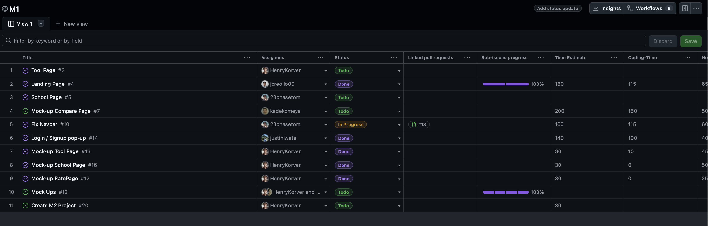

# RateMyTool(s)

## Table of Contents

* [Overview](#overview)
* [Links](#links)
* [Deployment](#deployment)
* [User Guide](#user-guide)
* [Community Feedback](#community-feedback)
* [Developer Guide](#developer-guide)
* [Development History](#development-history)
* [Team](#team)

## Overview

### The Problem

UH Manoa students are constantly searching for effective online learning resources to supplement their coursework—from video tutorials and practice platforms to AI tools and study aids. However, there is no centralized, student-driven platform where they can discover which tools actually work.

### The Solution

RateMyTool(s) is a community-driven review platform specifically for UH Manoa students to rate and review online learning resources, AI tools, and educational platforms. Similar to RateMyProfessor but for digital learning tools, students can:

* Search for resources by course code (e.g., ICS 314)
* Browse by category (e.g., coding practice, math tutoring, AI assistants)
* Search by tool name (e.g., Khan Academy, ChatGPT, Codecademy)
* View aggregate ratings and detailed student reviews
* Filter tools by specific UH Manoa courses
* Upvote helpful reviews and save favorite tools
* Receive personalized recommendations based on major and courses

## Links

* [GitHub Organization](https://github.com/RateMyTool)
* [Team Contract](docs/TeamBondingContract.pdf)
* [M1 Project Board](https://github.com/orgs/RateMyTool/projects/1)
* [M2 Project Board](https://github.com/orgs/RateMyTool/projects/2)

## Deployment

The application is deployed and available at: [RateMyTools on Vercel](https://rate-my-tools-sc.vercel.app)

## User Guide

This section provides a walkthrough of the RateMyTool(s) user interface and its capabilities.

### Landing Page



The landing page is presented to users when they visit the top-level URL of the site.

The landing page features:
* Overview of the platform's purpose
* Search functionality by college or tool
* Prominent search bar for quick discovery
* Clean, modern interface with library-themed background
* Login and Sign Up options

### Tool Directory / Browse Page



A searchable and filterable catalog organized by:
* Categories (AI Tools, Video Platforms, Practice Sites, Study Aids)
* UH Manoa departments and course prefixes
* Rating levels and popularity

### Individual Tool Profile Page



Each tool has a dedicated profile page displaying:
* Overall rating (5-star system)
* Student reviews with course tags
* Related/similar tools
* External link to the actual tool
* Course-specific feedback

### Add Review Page



Form for students to:
* Rate a tool across multiple dimensions
* Tag relevant UH courses
* Write detailed feedback
* Specify major and year for context

### Course-Specific Landing Pages



Dynamic pages (e.g., `/course/ICS314`) showing highly-rated tools reviewed specifically for that course.

## Community Feedback

*(This section will be updated with feedback from UH community members after deployment)*

## Developer Guide

This section provides information for developers wishing to use this code base as a basis for their own development tasks.

### Installation

First, [install PostgreSQL](https://www.postgresql.org/download/). Then create a database for your application.

Second, go to [https://github.com/RateMyTool/RateMyTools_SC](https://github.com/RateMyTool/RateMyTools_SC), and click the "Use this template" button. Complete the dialog box to create a new repository that you own that is initialized with this template's files.

Third, go to your newly created repository, and click the "Clone or download" button to download your new GitHub repo to your local file system. Using [GitHub Desktop](https://desktop.github.com/) is a great choice if you use MacOS or Windows.

Fourth, cd into the directory of your local copy of the repo, and install third party libraries with:
```
$ npm install
```

Fifth, create a `.env` file from the `sample.env` file. Edit the `.env` file to set the `DATABASE_URL` to point to your PostgreSQL database.

### Running the system

Once the libraries are installed and the database is configured, you can run the application by invoking:
```
$ npm run dev
```

The first time you run the app, it will create default data in the database.

### Viewing the running app

If all goes well, the application will appear at [http://localhost:3000](http://localhost:3000).

### ESLint

You can verify that the code obeys our coding standards by running ESLint over the code in the src/ directory with:
```
$ npm run lint
```

## Development History

The development process for RateMyTool(s) conformed to [Issue Driven Project Management](http://courses.ics.hawaii.edu/ics314f19/modules/project-management/) practices. In a nutshell:

* Development consists of a sequence of Milestones.
* Each Milestone is specified as a set of tasks.
* Each task is described using a GitHub Issue, and is assigned to a single developer to complete.
* Tasks should typically consist of work that can be completed in 2-4 days.
* The work for each task is accomplished with a git branch named "issue-XX", where XX is replaced by the issue number.
* When a task is complete, its corresponding issue is closed and its corresponding git branch is merged into master.
* The state (todo, in progress, complete) of each task for a milestone is managed using a GitHub Project Board.

The following sections document the development history of RateMyTool(s).

## Table Risk Management Excercise 



## ER-diagram 

Schema Prisma ER-Diagram 


RateMyTools ER-Diagram


### Milestone 1: Mockup Development

The goal of Milestone 1 is to create HTML mockups of the pages in the system.

Milestone 1 is managed using [RateMyTool GitHub Project Board M1](https://github.com/orgs/RateMyTool/projects/1):



Milestone 1 consisted of five issues, and progress was managed with the RateMyTool GitHub Project Board M1:


Each issue was implemented in its own branch, and merged into main when completed:


### Milestone 2: Data Model Development

The goal of Milestone 2 is to implement the data model and connect it to the user interface.

Milestone 2 is managed using [RateMyTool GitHub Project Board M2](https://github.com/orgs/RateMyTool/projects/2).

### Milestone 3: Final Touches

*(Coming soon)*

## Team

RateMyTool(s) is designed, implemented, and maintained by:

* [Joseph Creollo](https://github.com/jcreollo00)
* [Henry Korver](https://github.com/henrykorver)
* [Justin Iwata](https://github.com/justiniwata)
* [Kade Komeya](https://github.com/kadekomeya)
* [Chase Tom](https://github.com/23chasetom)

Team Portfolio Pages:
* [Joseph Creollo Portfolio](https://jcreollo00.github.io/)
* [Henry Korver Portfolio](https://henrykorver.github.io/)
* [Justin Iwata Portfolio](https://justiniwata.github.io/)
* [Kade Komeya Portfolio](https://kadekomeya.github.io/)
* [Chase Tom Portfolio](https://23chasetom.github.io/)

